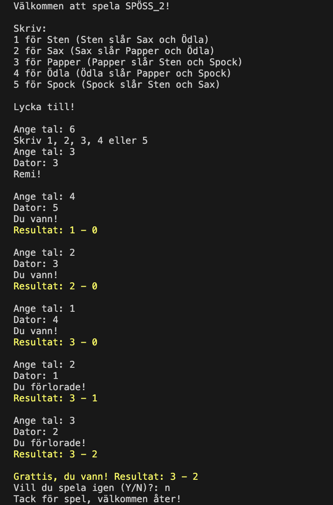

# Rock Paper Scissors Lizard Spock

---
## Description
This is a challenging single-player game against the computer. You need to choose one number, the computer also chooses a random number. The winner is the one who wins in 5 rounds with a score of 5:0, 4:1 or 3:2. After this, the game asks "Do you want to play again?" If you answer yes, the game starts again.

P.S.The text in the game is in Swedish

***

## Content in English 
  
__Welcome to play RPS!__
  
* Write 1 for Rock (Sten beats Scissors and Lizard)
* Write 2 for Scissors (Scissors beats Paper and Lizard)
* Write 3 for Paper (Paper beats Stone and Spock)
* Write 4 for Lizard (Lizard beats Paper and Spock)
* Write 5 for Spock (Spock beats Rock and Scissors)

  
__Good luck!__
  

__Ange tal__
Enter numbers
  
_If you entered incorrectly, you will see the message_: __Write 1, 2, 3, 4 or 5__
  
__Dator__
_This is a random choice of computer_
  
__Remi!__
_If your values are equal_
  
__Du vann!__
You won!
  
__Du förlorade!__
You lost!
  
_If you win 5 rounds with a score of 5:0, 4:1 or 3:2_:
  
__Grattis, du vann! Resultat:__
Congratulations, you won! Results:
  
_If you lost in 5 rounds with a score of 5:0, 4:1 or 3:2_:
  
__Tyvärr, förlorade du. Resultat:__
Sorry, you lost. Results:
  
__Vill du spela igen (Y/N)?__
Do you want to play again (Y/N)?
  
_If you write YES then the game [starts over](#start)_
  
_If you write NO, the game will end_
  
__Tack för spel, välkommen åter!__
Thanks for playing, welcome back!
  
_If you entered incorrectly, you will see the message_: __Answer y or n__

  
***

>___Everything in this game is built on FUNCTION. You can also see how I wrote it using WHILE  [here](https://github.com/ROOTZLA/SPOSS_2)___.
***
##Did You Know?

The game "rock, paper, scissors, lizard, Spock" was invented in 2005 by Sam Klemens and Karen Bryla. This version of the classic "rock, paper, scissors" game expands the possible moves by adding two additional gestures (lizard and Spock) and determining which combinations beat others. It became popular among geek and science fiction fan circles and is often referenced in pop culture, including the popular TV show "The Big Bang Theory".
***
[Up](#anchor)

